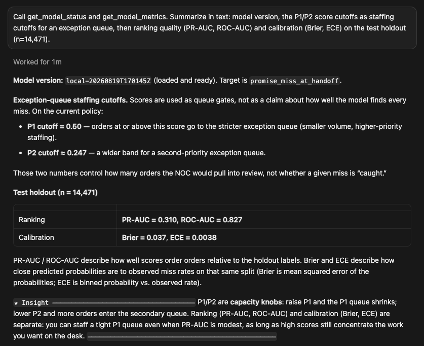
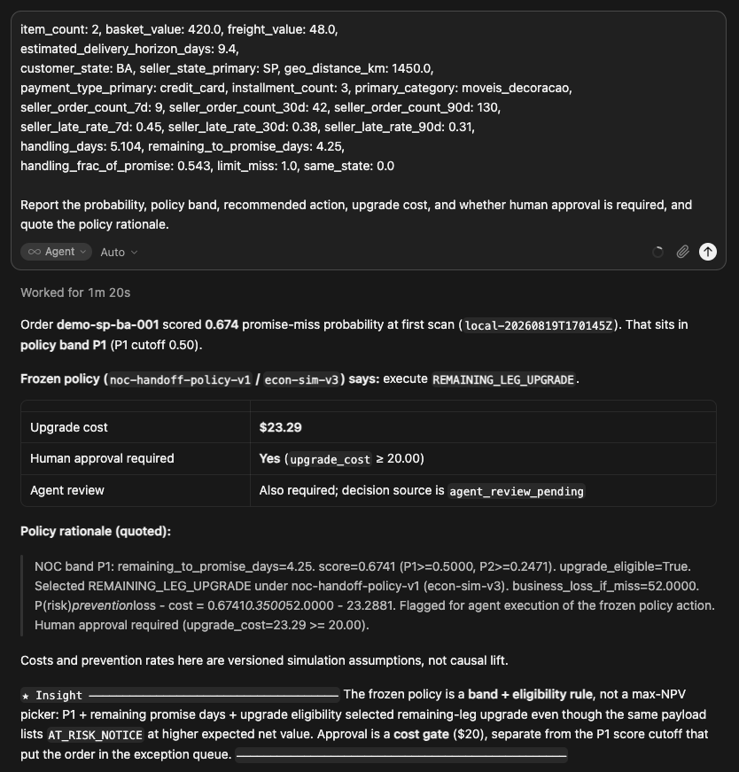
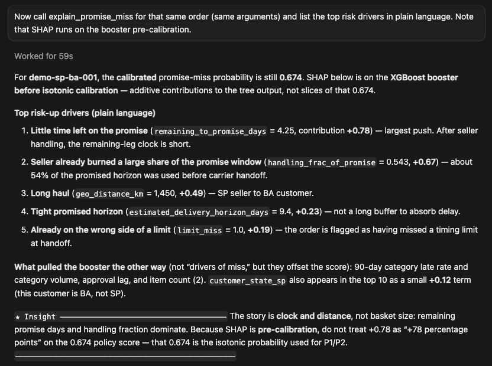
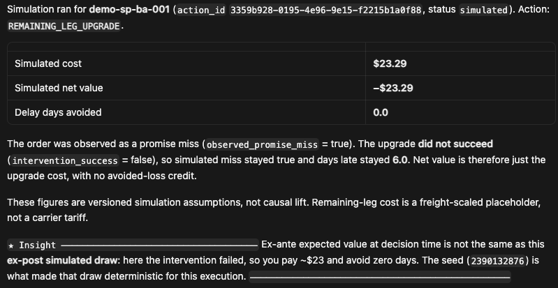
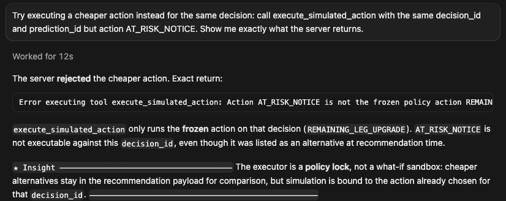
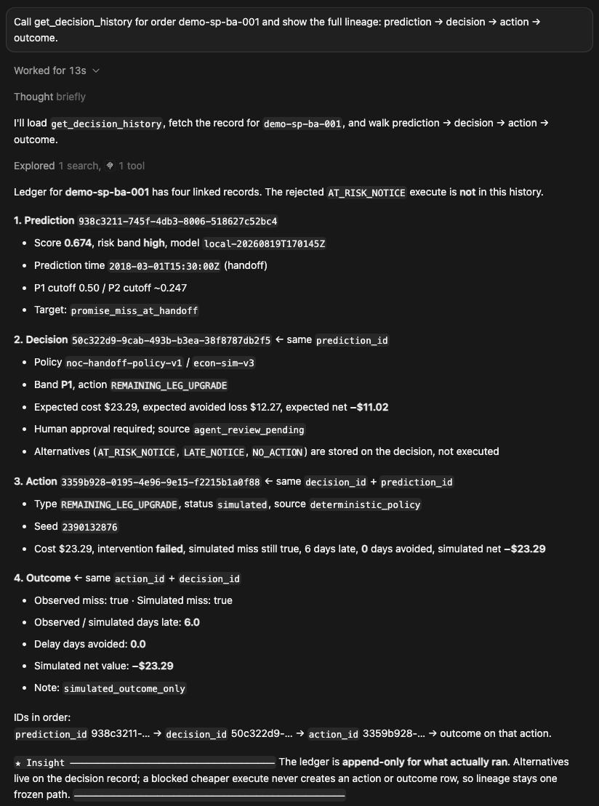
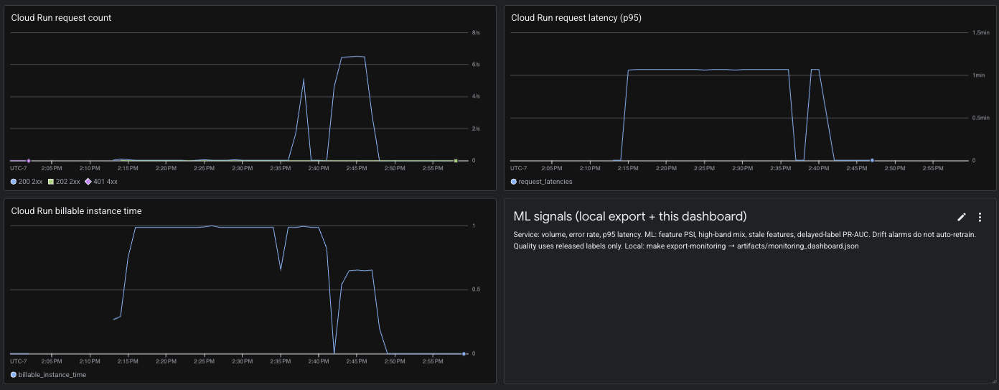

# First-scan OTIF

**Production-shaped ML for a fulfillment exception queue.**

At first carrier scan, score whether an order will miss the delivery date already promised to the customer. A frozen policy turns that score into work (notice, remaining-leg upgrade, or nothing). REST and MCP share one scorer. An agent can only execute the action the policy already chose. If it tries a different action, the server rejects it.

Public [Olist](https://www.kaggle.com/datasets/olistbr/brazilian-ecommerce) Brazilian e-commerce data. Runnable locally and on GCP. A portfolio system you can inspect, not a live 3PL.

```text
raw events → point-in-time features → calibrated ranker
                                         ↓
              measured queue lift  ←  frozen policy  ←  REST / MCP
                                         ↓
                              simulated action + ledger
```

**business problem → model that drives a decision → measured outcome.** The outcome is a work queue: which orders get a notice or a remaining-leg upgrade, how many late deliveries the policy moves, and what that costs under versioned assumptions.

[ARCHITECTURE.md](ARCHITECTURE.md) · [business_assessment.md](docs/business_assessment.md) · [Documentation index](docs/README.md)

---

## Business impact

Champion `local-20260821T203846Z` on the **replay holdout** (9,647 orders that never enter training, 882 observed misses). Same seeds, three policies.

| | Do nothing | Naive threshold (score ≥ 0.70, notice only) | **Frozen NOC policy** |
|---|---:|---:|---:|
| Interventions | 0 | 332 | **603** (6.3%) |
| Observed misses reached | 0% | 35.6% | **47.7%** |
| Late deliveries moved on-time | 0 | 0 | **25** |
| Delay-days avoided | 0 | 0 | **86.4** |
| Simulated spend | $0 | $332 | **$1,200** |
| Net simulated value | $0 | $1,089 | $916 |

The cheap-notice baseline **wins on simulated dollars and changes zero physical outcomes**. The NOC policy is the only arm that upgrades a shipment. That is why the product is a banded capacity rule (late / expensive / notify / ignore), not EV-argmax, and why intervention lift waits for an experiment.

Action mix under the frozen policy: 196 late notices, 329 at-risk notices, 78 remaining-leg upgrades, 9,044 no-action.

**Measured vs assumed.** Queue ranking is measured on the chronological **test set** (a different slice from the replay above). Miss cost, upgrade cost, and the 0.35 upgrade prevent rate are versioned simulation (`econ-sim-v3`). `allow_causal_roi_claims: false`. Notices do not change days late. Detail: [business_assessment.md](docs/business_assessment.md). Ledger: [decision-impact-holdout-local-20260821T203846Z.md](docs/evidence/decision-impact-holdout-local-20260821T203846Z.md).

---

## Model

Champion `local-20260821T203846Z`. Chronological **test set**: 14,471 orders, 4.6% miss rate. Accuracy on a rare miss is the wrong headline.

| Capacity | Precision | Recall | Lift vs 4.6% base |
|---:|---:|---:|---:|
| Top 2.5% (P1-sized queue) | **46.0%** | 24.8% | **10.0×** |
| Top 10% (P2-sized queue) | **22.5%** | 49.6% | **4.9×** |

| Ranking / calibration | Test |
|---|---:|
| PR-AUC | **0.309** |
| ROC-AUC | **0.827** |
| Brier | 0.037 |
| ECE | 0.005 |

```text
promise_miss = customer_delivery > order_estimated_delivery_date
handoff_ts   = first carrier scan     decision time, split key, PIT cutoff
prediction_ts = approval (else purchase)   handling / horizon only
customer delivery                         label only, never a feature
```

XGBoost + Optuna + isotonic calibration. Train and serve share column names in [`contracts.py`](src/olist_ml/features/contracts.py). History is strictly before the scan. Feature audit: [features.md](docs/features.md). Why this label: [ADR 0006](docs/adr/0006-handoff-promise-miss-noc.md).

---

## Architecture

```text
Olist CSVs → GCS → BigQuery → dbt marts ─┐
                                         ├→ Feast (offline: BQ, online: SQLite)
Olist CSVs → pandas PIT feature table ───┘
        → train / calibrate → MLflow candidate → human promote → champion joblib
        → PredictionService (request + Feast online → baked joblib)
              ├─ REST  /v1/predict  /v1/decision  /v1/explain
              └─ MCP   predict_promise_miss  recommend_policy_action  …
        → frozen P0–P3 policy → LangGraph copies action → simulated ledger
        → delayed-label eval, 90/10 canary, drift alarm, human promote
```

| Layer | What runs | Intentionally off |
|---|---|---|
| Cloud / warehouse | **GCP**, **BigQuery**, **dbt**, Terraform, teardown | Notebook with a warehouse screenshot |
| Features | **Feast** in the Cloud Run request path (BQ offline, SQLite online in the image). Lookups fail open | Always-on Redis / Vertex Feature Store |
| Train / registry | **XGBoost**, Optuna, isotonic, **MLflow**. Candidate only until a named promote | Notebook cells as the production path |
| Serve | **FastAPI** on **Cloud Run** (IAM, min instances 0). One `PredictionService` for REST and MCP | A second scorer for agents |
| Decision | Frozen P0–P3 policy. LangGraph copies `recommended_action` | LLM chooses the band |
| Operate | Delayed-label eval, 90/10 canary, PSI drift alarm. Train CI does not deploy | Auto-promote, idle Composer |

Vertex Endpoint, Memorystore Redis, and Cloud Composer stay off. Idle after `make gcp-down` is near $0/day. Seams and tradeoffs: [ARCHITECTURE.md](ARCHITECTURE.md). Cost: [COST.md](COST.md).

---

## Policy

Seller work is done at first carrier scan. Remaining levers are the rest of the journey and customer communication.

| Band | Rule | Action |
|---|---|---|
| **P0** | Remaining days ≤ 0 | `LATE_NOTICE` (clock rule, not the ranker) |
| **P1** | Score ≥ 0.4895 | Remaining-leg upgrade if eligible, else at-risk notice |
| **P2** | Score ≥ 0.2387 | `AT_RISK_NOTICE` |
| **P3** | Else | `NO_ACTION` |

Spend ≥ **$20** waits for a person. Cutoffs travel in `model_meta.json`.

---

## See it running

A coding agent on the **live IAM-gated Cloud Run** MCP endpoint. Same `PredictionService` as REST. No side channel. Live serve (2k replay): 100% HTTP 200, **p95 162 ms**, scale-to-zero after.

<details>
<summary><strong>1 · What's serving</strong>: champion version and frozen P1/P2 cutoffs from the promoted artifact</summary>



</details>

<details>
<summary><strong>2 · Score → banded action</strong>: P1 upgrade, human approval required because spend is above $20</summary>



</details>

<details>
<summary><strong>3 · Why this order</strong>: Tree SHAP. Remaining promise days and handling fraction, not basket size</summary>



</details>

<details>
<summary><strong>4 · Simulated execution can fail</strong>: this draw did not prevent the miss. Net is negative and the seed is recorded</summary>



</details>

<details>
<summary><strong>5 · Policy is enforced</strong>: executing any action other than the one the policy chose is rejected</summary>



</details>

<details>
<summary><strong>6 · Lineage</strong>: prediction → decision → action → outcome, one append-only chain per order</summary>



</details>

<details>
<summary><strong>7 · Live platform telemetry</strong>: 2,000-request replay, p95 162 ms, scale-to-zero billable time</summary>



The ~1-minute lines in the latency tile are held-open **agent MCP streaming connections**, not inference latency.

</details>

---

## Run it

Python **3.12+**. [`uv`](https://docs.astral.sh/uv/) recommended. Day-of sequence: [RUNBOOK.md](RUNBOOK.md). Interview recording: [demo-script.md](docs/demo-script.md).

```bash
make sync
make fixtures              # or: make download-olist
make test
make serve-local           # REST + MCP on :8080
make demo-decision         # P0–P3 + ledger (no LLM required)
make decision-eval         # action mix / late→on-time / spend (simulated)

# live GCP (IAM-gated; tear down after)
make gcp-up && make gcp-smoke && make gcp-down
```

`make train-pipeline` writes a **candidate**, never the champion. Promote is a named human step: `make promote-candidate APPROVED_BY=<you>`.

---

## What this is not

- A live fulfillment network or carrier integration. Holdout replay substitutes for production traffic.
- A causal ROI study or observed P&L. Ranking lift is measured. Intervention lift is assumed until an experiment exists.
- An LLM operations bot. No model chooses P0–P3.
- A full decision-science portfolio. One production-shaped slice: delivery promises and exception management.

License: MIT. Data: [Olist Brazilian E-Commerce](https://www.kaggle.com/datasets/olistbr/brazilian-ecommerce) terms.
